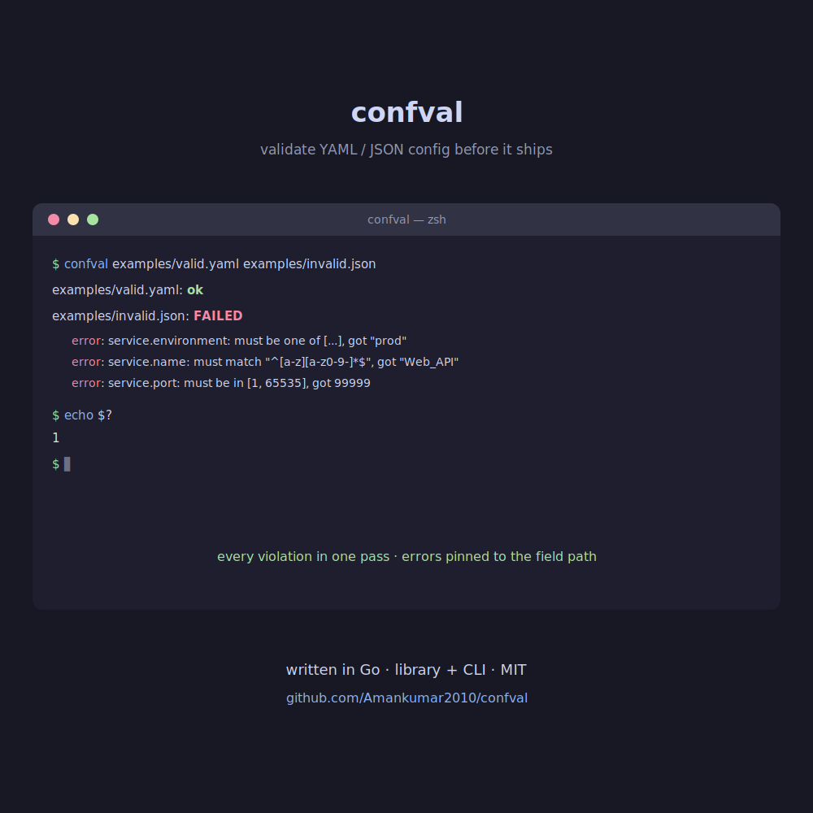

# confval

[](https://github.com/Amankumar2010/confval/actions/workflows/ci.yml)
[](https://pkg.go.dev/github.com/Amankumar2010/confval)
[](https://goreportcard.com/report/github.com/Amankumar2010/confval)
[](LICENSE)

Validate YAML and JSON configuration files against **custom business rules
written in Go** before they reach production. Use it as a library inside your
deploy pipeline, or as a CLI gate in CI.

- **One model, two formats** — YAML and JSON decode into the same shapes, so a
  rule written once works against both.
- **Collects every problem in one pass** — no fail-fast; a single run reports
  all violations, each anchored to its field path (`service.port: ...`).
- **Rules are just Go** — composable built-ins for the common cases, and a
  plain `func` escape hatch for anything bespoke.
- **Warnings vs. errors** — flag advisories that don't block a deploy.

<p align="center">
  
</p>

## Install

```sh
go get github.com/Amankumar2010/confval
```

## Library usage

```go
package main

import (
	"fmt"

	"github.com/Amankumar2010/confval"
	"github.com/Amankumar2010/confval/config"
)

func main() {
	v := confval.NewValidator(
		confval.Required("service.name", "service.port", "service.environment"),
		confval.IsString("service.name"),
		confval.Matches("service.name", `^[a-z][a-z0-9-]*$`),
		confval.InRange("service.port", 1, 65535),
		confval.OneOf("service.environment", "development", "staging", "production"),

		// Bespoke cross-field business logic: production needs >1 replica.
		confval.Func("prod_ha", func(c *config.Config) []confval.Violation {
			env, _ := c.Get("service.environment")
			reps, _ := c.Get("service.replicas")
			if env == "production" {
				if n, ok := reps.(int); !ok || n < 2 {
					return []confval.Violation{{
						Path:    "service.replicas",
						Message: "production requires at least 2 replicas",
					}}
				}
			}
			return nil
		}),
	)

	c, err := config.Load("config.yaml")
	if err != nil {
		panic(err)
	}
	report := v.Validate(c)
	if !report.OK() {
		fmt.Println(report) // prints each violation, one per line
		// os.Exit(1) in a real gate
	}
}
```

## CLI usage

The `cmd/confval` binary ships with an illustrative rule set — copy it as a
starting point and edit `ruleSet()` for your own policy.

```sh
go run ./cmd/confval examples/valid.yaml examples/invalid.json
```

```
examples/valid.yaml: ok
examples/invalid.json: FAILED
  error: service.environment: must be one of [development staging production], got "prod"
  error: service.name: must match "^[a-z][a-z0-9-]*$", got "Web_API"
  error: service.port: must be in [1, 65535], got 99999
```

Exit codes: `0` all valid, `1` one or more invalid, `2` usage/load error — so
`confval config/*.yaml` works directly as a CI gate.

## Built-in rules

| Constructor | Checks (when the path is present) |
|---|---|
| `Required(paths...)` | path exists and is non-null |
| `IsString` / `IsBool` / `IsNumber` / `IsList` / `IsMap` | value type |
| `NonEmpty(path)` | string/list/map is non-empty |
| `InRange(path, min, max)` | numeric value within `[min, max]` |
| `OneOf(path, allowed...)` | string is one of the allowed values |
| `Matches(path, regexp)` | string matches a pattern |
| `Predicate(name, path, test, msg)` | custom single-field predicate |
| `Func(name, fn)` | arbitrary logic, incl. cross-field rules |
| `AsWarning(rule)` | downgrade any rule's violations to warnings |

Every rule except `Required` ignores absent fields, so optional fields stay
quiet until you pair them with `Required`.

## Paths

Rules address values by dotted path. Map keys are segments; numeric segments
index into lists: `servers.0.port` reads `servers[0].port`.

## Development

```sh
go test ./...
go vet ./...
```

## License

[MIT](LICENSE)
